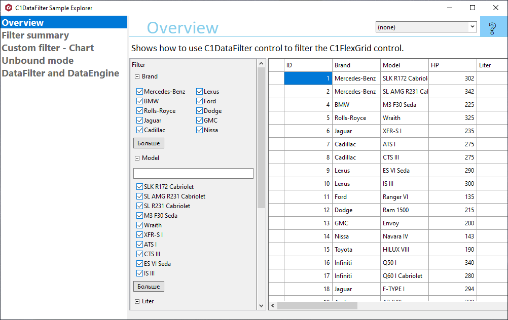

## DataFilterExplorer
#### [Download as zip](https://grapecity.github.io/DownGit/#/home?url=https://github.com/GrapeCity/ComponentOne-WinForms-Samples/tree/master/Next\DataFilter\CS\DataFilterExplorer)
____
#### Shows main samples of controls in the C1.Win.DataFilter assembly.
____
Included samples:

* Overview.
  Shows how to use C1DataFilter control to filter the C1FlexGrid control.
  This demo demonstrates basic functionality of the C1DataFilter control. 
  The DataFilter control supports different kinds of filters for different types of data.
  By default, filters are automatically generated depending on the type of the fields present in the DataSource.
  When end-user changes filter conditions, DataFilter applies conditions to the underlying data source.
  In this sample FlexGrid.DataSource property and DataFilter.DataSource property are both set to the same data collection. 
  That allows to filter FlexGrid content based on multiple conditions selected in the C1DataFilter. 
  The ChecklistFilter has rich binding API:
    a. The DisplayMemberPath property sets a path to a value on the source object to serve as the visual representation of the object.
    b. The ValueMemberPath sets a path to a value on the source object to serve as the value representation of the object.

* ChartAsDataFilter.
  Shows how to use FlexChart control as a custom filter for DataFilter control.
  This demo demonstrates using FlexChart for creating custom DataFilters in WinForms. 
  The sample showcases multiple filtering modes using FlexChart, namely:
    a. Normal Select: Click on any data point on the chart to show its corresponding details in the grid.
    b. Range Select: Hold and drag the mouse over a chart region to select a range of values. 
    The chart filters out records and displays the details for the selected range of items in the grid.
    c. RangeSlider: There is also an option to use a RangeSlider tool along with Numeric/DateTime editors to zoom-in/zoom out from the chart and filter the grid.
  Along with this, the sample also showcases a FlexChartDateTimeFilter which allows grouping DateTime data on the chart by Weeks, Months, Quarters, and Years.

* FilterSummary.
  Shows how to use the FilterSummary for the Checklist filter. 
  This sample shows how to use different aggregate expressions and custom format of filter summaries.
  The ChecklistFilter class contains the FilterSummary property for customizing filter summary:
    a. The AggregateType property defines a type of aggregate.
    b. The Label property sets a text on the left side of the summary, like "{label} {aggregate value}".
    c. The PropertyName property sets the name of the property for which the aggregate function is applied.
    d. The CustomFormat is used for formatting aggregation result, like "C0" for the "Max Price" aggregate.

* UnboundMode.
  Shows how to use C1DataFilter control in unbound mode.
  This sample demonstrates how to display a filter as a drop-down context menu for a grid column.
  This sample uses the GetFilterExpression method, which returns the current value of the filters.
  The GetPreferredSize method determines the optimal control size.

* DataFilterAndDataEngine.
  Shows how to filtering in the C1FlexGrid using the C1DataFilter when the C1DataEngine is a data source.

