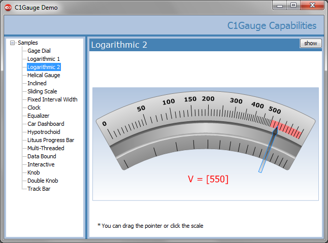

## GaugeDemo
#### [Download as zip](https://grapecity.github.io/DownGit/#/home?url=https://github.com/GrapeCity/ComponentOne-WinForms-Samples/tree/master/Next\Gauge\CS\GaugeDemo)
____
#### This sample shows various features of the C1Gauge control.
____
There are some capabilities which may be not evident from the documentation.
For example, you may create a gauge of an arbitrary shape using a group of C1GaugeSingleMark decorators.
This and other features are revealed in the GaugeDemo sample.

