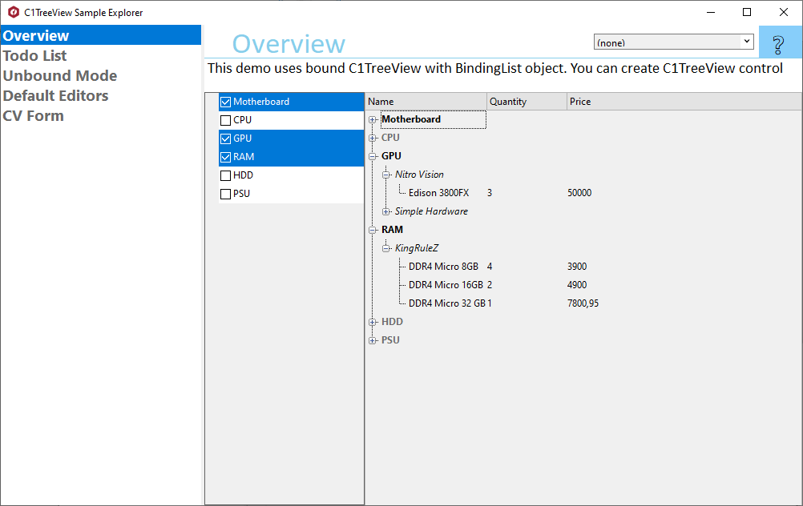

## TreeViewExplorer
#### [Download as zip](https://grapecity.github.io/DownGit/#/home?url=https://github.com/GrapeCity/ComponentOne-WinForms-Samples/tree/master/Next\TreeView\CS\TreeViewExplorer)
____
#### Shows main samples of controls in the C1.Win.TreeView assembly.
____
Included samples:

* Overview.
  Shows how to bind C1TreeView and C1CheckList controls to custom data.
  This demo uses bound C1TreeView with BindingList object.
  You can create C1TreeView control and setup it at design time or in code. 
  Use the RaiseApplyNodeStyles method and ApplyNodeStyles event to customize node styles of C1TreeView. 
  Also you can customize the appearance of columns and node cells.
  You can use C1CheckList in interaction with C1TreeView.

* Todo List.
  C1TreeView supports checkbox appearance in nodes.
  This sample shows how C1TreeView can be turned into todo list with sub-cases in any node.

* Unbound Mode.
  This sample shows how to use a unbound mode of TreeView.
  The TreeView in this sample allows to generate, view and modify data.

* Default Editors.
  This sample shows all default editors included into TreeView assembly.
  You can edit different data types on the fly.

* CV Form.
  This sample shows how to use the C1CheckList control as a list with multiple answers in input forms.
  In the provided sample the C1CheckList controls is used for selecting users' skills and known foreign languages.

